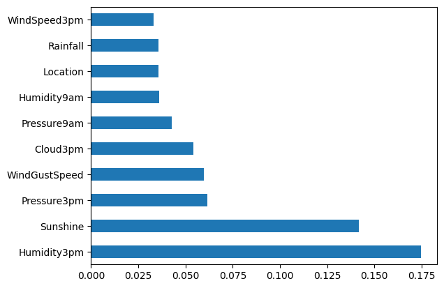
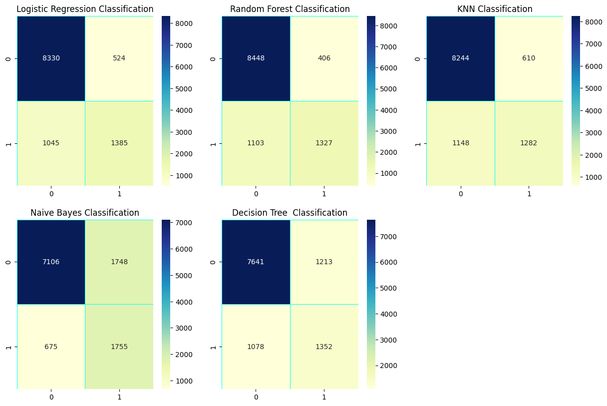

# Shi në Australi - Modeli i parashikimit të ditës së ardhshme
## Burim i të dhënave
Të dhënat e përdorura në këtë projekt u shkarkuan nga grupi i të dhënave Kaggle i titulluar Rain në Australi , i cili në vetvete ishte burim fillimisht nga Vëzhgimet Ditore të Motit të Byrosë Australiane të Meteorologjisë. Dataset-i përmban te dhëna rreth 10 vjet vëzhgime ditore të motit nga shumë vende në të gjithë Australinë. Nga ky data set ne do te parashikojmë shiun e ditës së ardhshme sipas modeleve të klasifikimit të trajnimit në variablin e synuar RainTomorrow .

Algoritmet qe do te përdoren për klasifikim te dhënave te reja janë: KNN , Decision Tree, Naïve Bayes

# Analiza e të dhënave eksploruese

## Përkufizimet e kolonave

Sipas autorit të grupit të të dhënave Kaggle kuptimet dhe njësitë për secilën nga kolonat në grupin e të dhënave janë si më poshtë:

| **Kolona** | **Definicioni** | **Njesia** |
| --------------- | -------------- | --------- |
| `Date` | Data e vëzhgimit | N/A |
| `Location` | Vendndodhja e stacionit të motit | N/A |
| `MinTemp` | Temperatura minimale nga 24 orë deri në 9 të mëngjesit. | Gradë Celsius |
| `MaxTemp` | Temperatura maksimale nga 24 orë deri në 9 të mëngjesit. | Gradë Celsius |
| `Rainfall` | Reshjet (reshjet) në 24 orë deri në 9 të mëngjesit.| Milimetra |
| `Evaporation` | Avullimi në 24 orë deri në 9 të mëngjesit | Milimetra |
| `Sunshine` | Me diell të ndritshëm në 24 orë deri në mesnatë | orë |
| `WindGustDir` |Drejtimi i erës më të fortë në 24 orë deri në mesnatë | Busull |
| `WindGustSpeed` | Shpejtësia e erës më të fortë në 24 orë deri në mesnatë | Kilometra në orë |
| `WindDir9am` | Drejtimi i erës në orën 9 të mëngjesit | Busull |
| `WindDir3pm` | Drejtimi i erës në orën 15:00 | Busull |
| `WindSpeed9am` | Shpejtësia e erës në 9 të mëngjesit | Kilometra në orë |
| `WindSpeed3pm` | Shpejtësia e erës në orën 15.00 | Kilometra në orë |
| `Humidity9am` | Lagështia relative në orën 9 të mëngjesi | Përqindje |
| `Humidity3pm` | Lagështia relative në orën 3 të dites | Përqindje |
| `Pressure9am` | Presioni atmosferik u ul në nivelin mesatar të detit në orën 9 të mëngjesit | Hektopaskal |
| `Pressure3pm` | Presioni atmosferik u ul në nivelin mesatar të detit në orën 3 të dites | Hektopaskal |
| `Cloud9am` | Një pjesë e qiellit e errësuar nga retë në orën 9 të mëngjesit | Eighths |
| `Cloud3pm` | Një pjesë e qiellit e errësuar nga retë në orën 3 të dites| Eighths |
| `Temp9am` | Temperatura në 9 të mëngjesit | Gradë Celsius |
| `Temp3pm` | Temperatura në 3 të dites | Gradë Celsius |
| `RainToday` | A ka pasur reshje në ditën aktuale që tejkalojnë 1 mm në 24 orë deri në 9 të mëngjesit | Binary (0 = No, 1 = Yes) |
| `RainTomorrow` |A do të ket te nesërmen reshje që kalonin 1 mm në 24 orë deri në 9 të mëngjesit | Binary (0 = No, 1 = Yes) |

# Parapërpunimi i të dhënave

## Vlerat që mungojnë

Nevoja kryesore e para përpunimit për këtë grup të dhënash është trajtimi i vlerave që mungojnë. Duke pasur parasysh korrelacionet e forta midis veçorive të caktuara, ne fazën e pare te projektit kemi larguar te gjitha te dhënat qe kanë ne përmbajtje vlera NULL. Pas largimit te vlerave NULL data set-i ynë nga 145460 te dhëna (rreshta) dhe 23 kolona reduktohet ne 56420 te dhëna (rreshta) dhe 23 kolona.

## Largimi i vlerave Dublikate

Pas largimit te vlerave NULL data set-i i nënshtrohet edhe para përpunimit për vlera te dyfishta përmes metodës drop_duplicates() e qe e cila nuk ka larguar asnjë te dhënë, nga këtu kuptojmë se data set-i ynë nuk përmban te dhëna Duplicate

## Largimi i Outliers

Outliers paraqet pikën e të dhënave që është e largët nga pikat e tjera në grupin e të dhënave. Është një anomali në grupin e të dhënave që mund të shkaktohet nga një sërë gabimesh në kapjen, përpunimin ose manipulimin e të dhënave. Data set-i ynë i nënshtrohet edhe para përpunimit për heqjen e vlerave Outliers. Pasi qe kolona e datës   paraqet disa probleme për modelin në aspektin e efikasitetit dhe gjithashtu dimensionet e të dhënave rriten kur kodohen në të dhëna numerike largohet nga data set-i.

## Konvertimi i të dhënave kategorike  në të dhëna numerike për modelim

Ne fazën e par te projektit ne para procesimin e data setit është bere edhe identifikimi i te dhënave kategorike dhe numerike. Te dhënat kategorike janë konvertuar ne te dhëna numerike dhe janë përgatitur për klasifikim.

# Modelimi

Pas para procesimit te data set-it te dhenat pergaditen per klasifikim. Te dhenat ndahen ne 20% testing  dhe 80% training dhe me pas nxjerren edhe kolonat qe kan ndikim ne parashikimin e sakt te RainTomorrow permes metodes Feature Importance e cila i referohet teknikave që caktojnë një pikë për veçoritë hyrëse/etiketuar bazuar në atë se sa të dobishme janë ato në parashikimin e një ndryshoreje të synuar

## Algoritmet e perdoruar per Klasifikim
Ne data set-in ton kemi perdorur disa Algoritme apo metoda per klasifikim :
1. Logistic Regression
2. Random Forest
3. KNN
4. Naive Bayes
5. Decision Tree

Pas gjdo metode te klasifikimit eshte printuar rezultati i parashikimit si dhe nje raport mbi klasifikim.

# Konkluzioni

## Rezultatet
Modeli me performancën më të mirë është modeli Random Forest i akorduar me hiperparametër me një saktësi prej afërsisht 86%. Rezultatet si për të dhënat e trajnimit ashtu edhe për testimin ishin të ngjashme, duke reduktuar shqetësimet për përshtatjen e tepërt të modelit. Për sa i përket rëndësisë së veçorive, Humidity3pmështë tipari i vetëm më i rëndësishëm. Megjithatë, kur grupohen veçoritë në kategoritë e tyre origjinale, grupet e mëposhtme kanë rëndësinë më të madhe:

Location
WindDir3pm
WindDir9am
WindGustDir
Month
Humidity3pm

Dhe ne fund eshte shfaqur nje raport i klasifikimit permbledhes duke marr keto rezultati nga metodat klasifikuse:

1. Logistic Regression Score      0.860954
2. Random Forest Machine Score    0.866271
3. K-Nearest Neighbour Score      0.844204
4. Naive Bayes Score              0.785271
5. Decision Tree Score            0.796969

